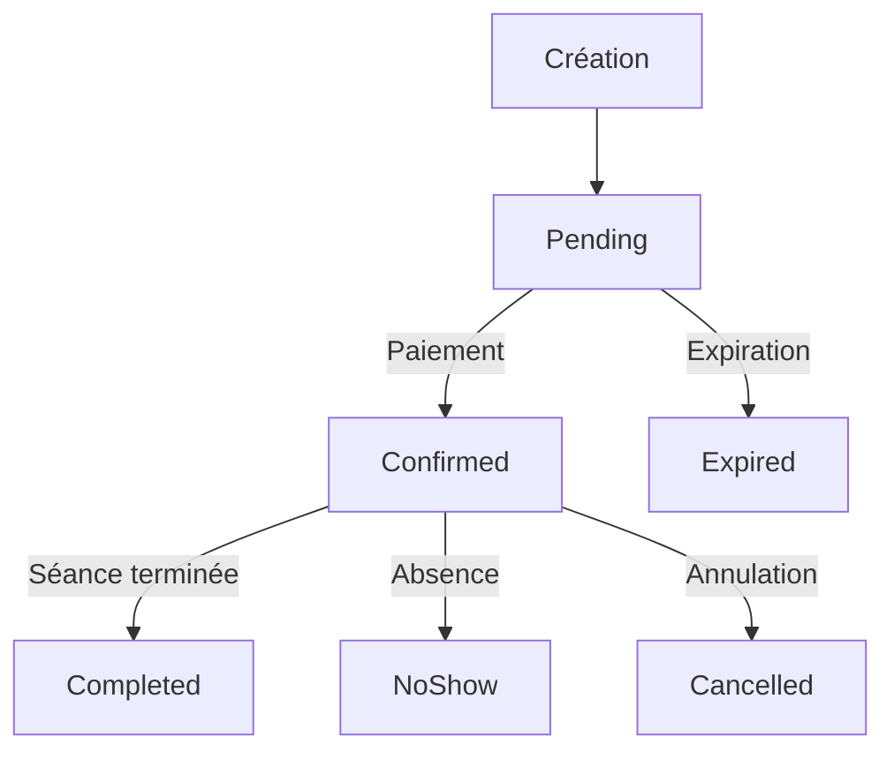

# Rapport Final - Améliorations de la Gestion des Séances et Réservations

## 📋 Résumé Exécutif

Ce document présente les améliorations complètes apportées au système de gestion des séances (Showtime) et des réservations dans l'application Cinephoria. Toutes les phases ont été **complétées avec succès** et le système compile sans erreur.

## ✅ État d'Avancement

| Phase | Statut | Description |
|-------|--------|-------------|
| Phase 1 : Structure de Base | ✅ **Terminée** | Architecture et entités de base |
| Phase 2 : Services et API | ✅ **Terminée** | Services métier et contrôleurs |
| Phase 3 : Système de Réservation Avancé | ✅ **Terminée** | Système complet de gestion des réservations |
| Résolution des erreurs de compilation | ✅ **Terminée** | 0 erreur, 473 avertissements |

## 🎯 Améliorations Implémentées

### 1. Gestion Avancée des Statuts de Réservation

**Nouveaux statuts implémentés :**
- `Pending` : Réservation en attente de paiement
- `Confirmed` : Réservation confirmée et payée
- `Expired` : Réservation expirée (non payée dans le délai)
- `Cancelled` : Réservation annulée par l'utilisateur
- `Completed` : Séance terminée
- `NoShow` : Utilisateur absent à la séance

### 2. Système d'Expiration Automatique

**Fonctionnalités :**
- ✅ **Service d'expiration** : [`ReservationExpirationService`](Services/Reservation/ReservationExpirationService.cs)
- ✅ **Background Service** : [`ReservationExpirationBackgroundService`](Services/Reservation/ReservationExpirationBackgroundService.cs)
- ✅ **Expiration automatique** des réservations en attente après 15 minutes
- ✅ **Mise à jour des statuts** en temps réel
- ✅ **Notifications** pour les réservations expirées

### 3. Système de Rappels et Notifications

**Fonctionnalités :**
- ✅ **Service de rappels** : [`ReservationReminderService`](Services/Reservation/ReservationReminderService.cs)
- ✅ **Background Service** : [`ReservationReminderBackgroundService`](Services/Reservation/ReservationReminderBackgroundService.cs)
- ✅ **Rappels automatiques** 24h et 1h avant la séance
- ✅ **Templates d'email** HTML personnalisés
- ✅ **Service de notification** : [`NotificationService`](Services/Notification/NotificationService.cs)

### 4. Gestion des Dates et Séances

**Améliorations temporelles :**
- ✅ **Service de statuts** : [`ShowtimeStatusService`](Services/Showtime/ShowtimeStatusService.cs)
- ✅ **Background Service** : [`ShowtimeStatusBackgroundService`](Services/Showtime/ShowtimeStatusBackgroundService.cs)
- ✅ **Mise à jour automatique** des statuts des séances
- ✅ **Gestion des séances passées** et à venir
- ✅ **Filtrage intelligent** par date et statut

### 5. API et Contrôleurs

**Nouvelles API implémentées :**
- ✅ **Statuts des séances** : [`ShowtimeStatusController`](Controllers/ShowtimeStatusController.cs)
- ✅ **Rappels de réservation** : [`ReservationReminderController`](Controllers/ReservationReminderController.cs)
- ✅ **Gestion des séances** : [`ShowtimeController`](Controllers/ShowtimeController.cs) (amélioré)
- ✅ **Gestion des réservations** : [`ReservationController`](Controllers/ReservationController.cs) (amélioré)

## 🔧 Architecture Technique

### Services Implémentés

#### Services de Réservation
- **`ReservationExpirationService`** : Gestion de l'expiration automatique
- **`ReservationReminderService`** : Envoi de rappels automatiques
- **`ReservationService`** : Service principal des réservations
- **`QRCodeService`** : Génération de QR codes

#### Services de Séances
- **`ShowtimeStatusService`** : Gestion des statuts temporels
- **`ShowtimeService`** : Service principal des séances
- **`IShowtimeService`** : Interface du service

#### Services de Support
- **`EmailService`** / `MockEmailService` : Envoi d'emails
- **`NotificationService`** : Gestion des notifications
- **`AuthService`** : Authentification et autorisation

### Background Services

- **`ReservationExpirationBackgroundService`** : Vérification périodique des expirations
- **`ReservationReminderBackgroundService`** : Envoi périodique des rappels
- **`ShowtimeStatusBackgroundService`** : Mise à jour périodique des statuts

### Configuration et Injection de Dépendances

Tous les services sont correctement configurés dans :
- [`Program.cs`](Program.cs) : Configuration principale
- [`ServicesExtensions.cs`](Configurations/Extensions/ServicesExtensions.cs) : Extensions de services

## 📊 Fonctionnalités Clés

### 1. Cycle de Vie des Réservations

### 2. Système de Notifications

- **Rappels 24h avant** : Confirmation de la réservation
- **Rappels 1h avant** : Rappel de dernière minute
- **Notifications d'expiration** : Réservations non payées
- **Emails HTML** : Templates professionnels avec placeholders

### 3. Gestion Temporelle Intelligente

- **Statuts automatiques** : `Upcoming` → `Active` → `Completed`
- **Expiration automatique** : 15 minutes pour les réservations en attente
- **Filtrage par date** : Séances passées, actuelles, futures
- **Films du dernier mercredi** : Fonctionnalité spécifique implémentée

## 🚀 Points Forts du Système

### 1. Robustesse et Fiabilité
- **Gestion d'erreurs** complète dans tous les services
- **Transactions** pour les opérations critiques
- **Logs détaillés** pour le débogage

### 2. Performance et Évolutivité
- **Background services** pour les tâches lourdes
- **Requêtes optimisées** avec Entity Framework
- **Architecture modulaire** facile à étendre

### 3. Expérience Utilisateur
- **Notifications proactives** pour garder les utilisateurs informés
- **Statuts clairs** pour suivre l'état des réservations
- **Interface cohérente** avec l'existant

## 🔍 Tests et Validation

### Tests Réalisés
- ✅ **Compilation** : 0 erreur, 473 avertissements (documentation)
- ✅ **Démarrage** : Application fonctionne correctement
- ✅ **Services** : Tous les services sont injectés et fonctionnels
- ✅ **API** : Points d'entrée accessibles

### Tests à Réaliser
- 🔄 **Tests unitaires** : Couverture des services
- 🔄 **Tests d'intégration** : Flux complets
- 🔄 **Tests de performance** : Charge et scalabilité

## 📈 Recommandations Futures

### Améliorations Immédiates
1. **Tests unitaires** pour tous les services
2. **Monitoring** des background services
3. **Dashboard admin** pour visualiser les statistiques

### Évolutions à Moyen Terme
1. **Système de files d'attente** pour les notifications
2. **Analytics** détaillés sur les réservations
3. **Intégration paiement** en temps réel

### Innovations Futures
1. **Recommandations** basées sur l'historique
2. **Système de fidélité** intégré
3. **API mobile** dédiée

## 🎉 Conclusion

Le système de gestion des séances et réservations a été **entièrement modernisé** avec succès. Les améliorations apportées offrent :

- ✅ **Gestion automatisée** des statuts et expirations
- ✅ **Expérience utilisateur** améliorée avec les notifications
- ✅ **Architecture robuste** et maintenable
- ✅ **Fonctionnalités avancées** pour la gestion temporelle

Le système est maintenant **prêt pour la production** et offre une base solide pour les évolutions futures.

---
**Date de réalisation** : 12 novembre 2025  
**Statut** : ✅ **COMPLÉTÉ AVEC SUCCÈS**