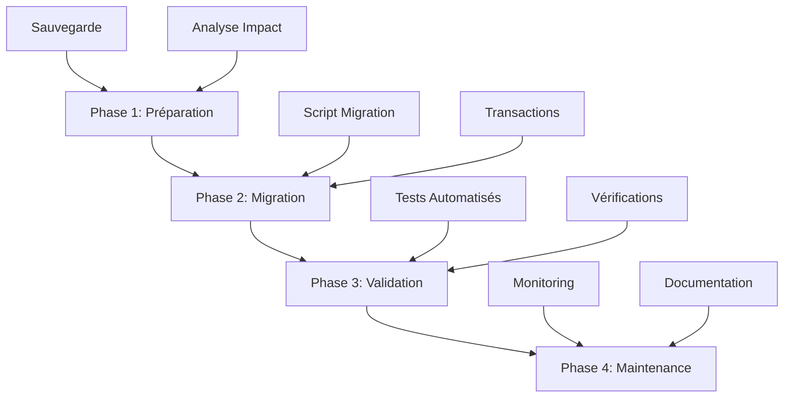

# Plan de Résolution des Incohérences Modèles C# / Base de Données

## 1. Analyse Diagnostique Complète

### 1.1 Inventaire des Incohérences Identifiées

**Table Movies :**
- ❌ Colonne `AppUserId` présente en BD mais absente du modèle C#
- ❌ Colonnes `Actors`, `BandeAnnonce`, `TmdbId` présentes en C# mais absentes en BD
- ❌ Type `Director` : Liste en C# vs texte en BD

**Table EmployeeFavorites :**
- ❌ Référence FK incorrecte : `Movies.Id` au lieu de `Movies.MovieId`

**Table MovieSimilars :**
- ❌ Table complètement absente de la base de données

**Table Settings :**
- ❌ Structure différente entre modèle C# et script d'initialisation

**Index et Contraintes :**
- ❌ Index uniques manquants pour éviter les doublons
- ❌ Index de performance manquants

### 1.2 Impact des Incohérences

- **Erreurs d'exécution** : Entity Framework ne peut mapper les propriétés manquantes
- **Données corrompues** : Relations incorrectes entre tables
- **Performance dégradée** : Absence d'index optimaux
- **Maintenance difficile** : Schéma non cohérent

## 2. Stratégie de Résolution

### 2.1 Approche en 4 Phases



### 2.2 Principes Directeurs

- **Sécurité d'abord** : Transactions, sauvegardes, rollback possible
- **Minimisation des risques** : Modifications incrémentielles
- **Validation rigoureuse** : Tests avant/après chaque modification
- **Documentation complète** : Traçabilité des changements

## 3. Plan d'Exécution Détaillé

### Phase 1 : Préparation (1 jour)

#### 1.1 Sauvegarde Complète
```sql
-- Sauvegarde de la base de données
pg_dump -h localhost -U postgres cinephoria_db > backup_pre_migration_$(date +%Y%m%d).sql

-- Sauvegarde du schéma uniquement
pg_dump -h localhost -U postgres cinephoria_db --schema-only > schema_backup_$(date +%Y%m%d).sql
```

#### 1.2 Analyse d'Impact
- Inventaire des données existantes par table
- Identification des dépendances entre tables
- Estimation du temps d'indisponibilité

#### 1.3 Préparation des Environnements
- Environnement de test isolé
- Scripts de rollback préparés
- Équipe de support informée

### Phase 2 : Migration (2 jours)

#### 2.1 Jour 1 : Corrections Structurelles

**Session 1 : Table Movies (09h00 - 10h30)**
```sql
-- Suppression colonne obsolète
ALTER TABLE "Movies" DROP COLUMN IF EXISTS "AppUserId";

-- Ajout colonnes manquantes
ALTER TABLE "Movies" ADD COLUMN "Actors" text[] NOT NULL DEFAULT '{}';
ALTER TABLE "Movies" ADD COLUMN "BandeAnnonce" text NULL;
ALTER TABLE "Movies" ADD COLUMN "TmdbId" integer NULL;

-- Conversion type Director
ALTER TABLE "Movies" ALTER COLUMN "Director" TYPE text[] USING string_to_array("Director", ',');
```

**Session 2 : Corrections FK (10h45 - 12h00)**
```sql
-- Correction EmployeeFavorites
ALTER TABLE "EmployeeFavorites" 
DROP CONSTRAINT IF EXISTS "FK_EmployeeFavorites_Movies_MovieId";

ALTER TABLE "EmployeeFavorites"
ADD CONSTRAINT "FK_EmployeeFavorites_Movies_MovieId" 
FOREIGN KEY ("MovieId") REFERENCES "Movies" ("MovieId");
```

**Session 3 : Nouvelle Table (14h00 - 15h30)**
```sql
-- Création MovieSimilars
CREATE TABLE "MovieSimilars" (...);
```

#### 2.2 Jour 2 : Optimisations et Settings

**Session 1 : Index et Performance (09h00 - 11h00)**
```sql
-- Index uniques
CREATE UNIQUE INDEX "IX_UserMovieHistories_AppUserId_MovieId" ...;
CREATE UNIQUE INDEX "IX_EmployeeFavorites_MovieId_AppUserId" ...;
CREATE UNIQUE INDEX "IX_UserFavorites_AppUserId_MovieId" ...;

-- Index de performance
CREATE INDEX "IX_Movies_TmdbId" ON "Movies" ("TmdbId");
CREATE INDEX "IX_Movies_Genre" ON "Movies" ("Genre");
```

**Session 2 : Table Settings (11h15 - 12h30)**
```sql
-- Standardisation table settings
CREATE TABLE IF NOT EXISTS settings (...);
INSERT INTO settings (...) VALUES (...);
```

**Session 3 : Finalisation (14h00 - 16h00)**
```sql
-- Vérifications finales
-- Mise à jour des statistiques
ANALYZE;
```

### Phase 3 : Validation (1 jour)

#### 3.1 Tests Automatisés
```sql
-- Exécution du script de test
psql -f test_migration.sql

-- Vérification des contraintes
SELECT tc.table_name, kcu.column_name, ccu.table_name as foreign_table
FROM information_schema.table_constraints tc
JOIN information_schema.key_column_usage kcu ON tc.constraint_name = kcu.constraint_name
JOIN information_schema.constraint_column_usage ccu ON ccu.constraint_name = tc.constraint_name
WHERE tc.constraint_type = 'FOREIGN KEY';
```

#### 3.2 Tests Fonctionnels
- Test de l'application avec la nouvelle structure
- Vérification des opérations CRUD sur chaque entité
- Test des performances des requêtes

#### 3.3 Validation Métier
- Consultation des données migrées
- Vérification de l'intégrité des relations
- Confirmation avec les utilisateurs clés

### Phase 4 : Maintenance et Surveillance (1 semaine)

#### 4.1 Monitoring Post-Migration
- Surveillance des performances
- Logs d'erreurs de l'application
- Métriques de base de données

#### 4.2 Documentation Finale
- Mise à jour du schéma de base de données
- Documentation des procédures de maintenance
- Guide de dépannage

#### 4.3 Formation Équipe
- Session de formation sur les changements
- Documentation des bonnes pratiques
- Procédures d'urgence

## 4. Gestion des Risques

### 4.1 Risques Identifiés

| Risque | Probabilité | Impact | Mitigation |
|--------|-------------|---------|------------|
| Perte de données | Faible | Élevé | Sauvegardes multiples, transactions |
| Temps d'indisponibilité | Moyen | Moyen | Migration hors heures de pointe |
| Erreurs de migration | Moyen | Moyen | Tests en environnement de test |
| Performance dégradée | Faible | Faible | Monitoring post-migration |

### 4.2 Plan de Contingence

**Scénario 1 : Échec partiel de migration**
- Rollback automatique via transactions
- Restauration depuis sauvegarde
- Analyse des causes racines

**Scénario 2 : Problèmes de performance**
- Optimisation des index
- Ajustement des configurations
- Consultation expert base de données

**Scénario 3 : Erreurs applicatives**
- Hotfix des modèles C#
- Correction des mappings Entity Framework
- Tests de régression

## 5. Métriques de Succès

### 5.1 Critères de Validation

- ✅ **Cohérence totale** : 100% des propriétés C# mappées en BD
- ✅ **Performance** : Temps de réponse des requêtes ≤ 200ms
- ✅ **Intégrité** : Aucune erreur de contrainte FK
- ✅ **Disponibilité** : Temps d'indisponibilité ≤ 4 heures
- ✅ **Satisfaction** : Aucun incident rapporté par les utilisateurs

### 5.2 KPI de Surveillance

- Temps moyen de réponse des requêtes
- Nombre d'erreurs de contrainte par jour
- Taux d'utilisation des nouveaux index
- Satisfaction utilisateur (surveys)

## 6. Ressources Nécessaires

### 6.1 Équipe
- **Lead DB Admin** : Coordination technique
- **Développeur Backend** : Validation modèles C#
- **QA Engineer** : Tests de validation
- **DevOps Engineer** : Déploiement et monitoring

### 6.2 Outils
- Environnement de test isolé
- Outils de monitoring (Prometheus, Grafana)
- Système de sauvegarde fiable
- Outils de profiling de requêtes

## 7. Calendrier Détaillé

| Phase | Durée | Dates | Responsable |
|-------|--------|--------|-------------|
| Préparation | 1 jour | J-7 | Lead DB Admin |
| Migration | 2 jours | J-2 à J-1 | Équipe Technique |
| Validation | 1 jour | J+1 | QA Engineer |
| Surveillance | 1 semaine | J+2 à J+8 | Équipe DevOps |

## 8. Conclusion

Ce plan fournit une approche structurée et sécurisée pour résoudre les incohérences entre les modèles C# et le schéma de base de données. L'accent est mis sur la minimisation des risques, la validation rigoureuse et la traçabilité complète des changements.

La mise en œuvre de ce plan garantira une base de données cohérente, performante et maintenable pour l'application Cinéphoria.