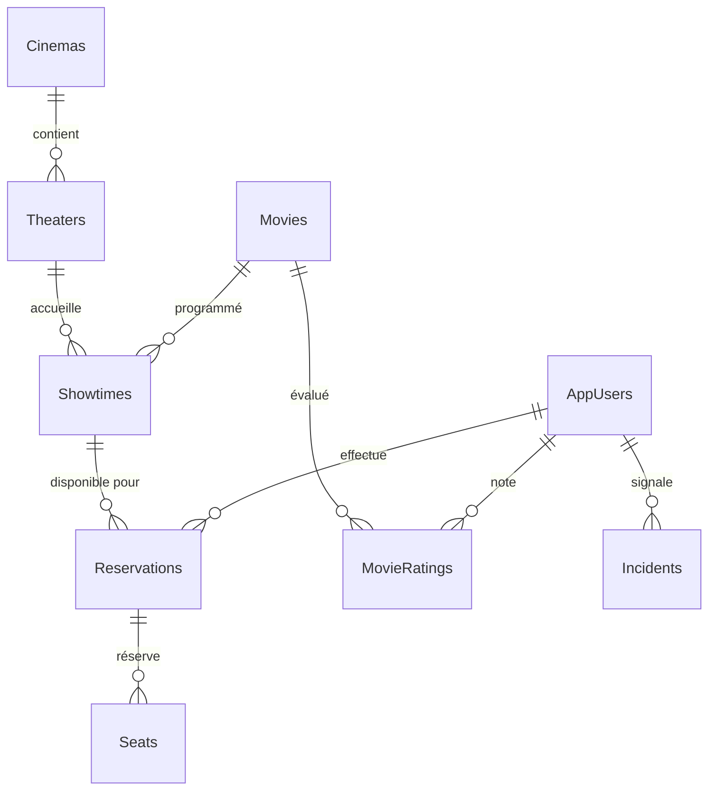

# CinephoriaWebApp

# Présentation du Projet CinephoriaServer

## 📋 Aperçu du Projet
CinephoriaServer est une application backend complète développée en ASP.NET Core 8.0 pour la gestion d'un système de cinéma. Elle sert de base pour des applications web, mobiles et desktop, offrant des fonctionnalités complètes de gestion de films, réservations, utilisateurs et analytics.

## 🏗️ Architecture Technique
- **Backend**: ASP.NET Core 8.0 avec Entity Framework Core
- **Bases de données**: PostgreSQL (données relationnelles) + MongoDB (données analytiques)
- **Authentification**: JWT avec ASP.NET Identity
- **Logging**: Serilog avec écriture dans des fichiers et console
- **API RESTful**: Documentation Swagger/OpenAPI complète

## 🎯 Fonctionnalités Principales

### 👥 Gestion des Utilisateurs
- Système de rôles (Admin, Employee, User)
- Inscription et connexion avec confirmation email
- Gestion des profils utilisateurs et employés
- Upload d'images de profil
- Réinitialisation de mot de passe

### 🎬 Gestion des Films
- CRUD complet des films avec métadonnées
- Upload d'affiches de films
- Système de notation et commentaires
- Filtrage par genre, cinéma et date
- Label "Coup de cœur" pour les films recommandés

### 🎟️ Système de Réservation
- Réservation de places avec génération de QR codes
- Gestion des séances et disponibilités
- Calcul automatique des prix
- Validation des réservations

### 🏢 Gestion des Cinémas
- Multiples cinémas avec salles individuelles
- Gestion des horaires d'ouverture
- Capacités et caractéristiques des salles

### 📊 Dashboard Administratif
- Analytics et statistiques en temps réel
- Suivi des réservations et revenus
- Gestion des incidents techniques
- Rapports de performance

## 🗄️ Structure de la Base de Données

### PostgreSQL (Données Principales)


### MongoDB (Données Analytiques)
- Statistiques des films
- Tendances de réservations
- Données de performance
- Logs d'activité

## 🔐 Système d'Authentification
- **JWT Bearer Tokens** avec expiration configurable
- **Rôles hiérarchiques**:
  - Admin: Accès complet
  - Employee: Gestion opérationnelle
  - User: Fonctionnalités client
- **Validation d'email** obligatoire
- **Politiques de mot de passe** configurables

## 🛠️ Technologies Utilisées
- **ASP.NET Core 8.0** - Framework principal
- **Entity Framework Core** - ORM pour PostgreSQL
- **MongoDB.Driver** - Client MongoDB
- **AutoMapper** - Mapping objet-objet
- **JWT Bearer Authentication** - Sécurité API
- **MailKit** - Envoi d'emails transactionnels
- **ZXing.Net** - Génération de QR codes
- **Serilog** - Logging structuré

## 📁 Structure du Projet
```
CinephoriaServer/
├── Controllers/          # Contrôleurs API
├── Models/              # Modèles de données
│   ├── PostgresqlDb/    # Modèles PostgreSQL
│   └── MongoDB/         # Modèles MongoDB
├── Services/            # Couche métier
├── Repository/          # Pattern Repository
├── Configurations/      # Configurations et extensions
└── Documentation/       # Documentation technique
```

## 🌟 Points Forts
- Architecture modulaire et extensible
- Double base de données optimisée pour chaque usage
- Sécurité renforcée avec validation multi-niveaux
- API complètement documentée avec Swagger
- Système de logging robuste avec Serilog
- Support multi-plateforme (web, mobile, desktop)

## 🚀 Statut Actuel
Le projet est fonctionnel avec toutes les fonctionnalités de base implémentées. Les prochaines étapes pourraient inclure l'optimisation des performances, l'ajout de tests unitaires, et l'intégration avec des services externes comme les paiements en ligne.

Cette architecture solide permet une évolution facile vers une application de production avec scaling horizontal et haute disponibilité.